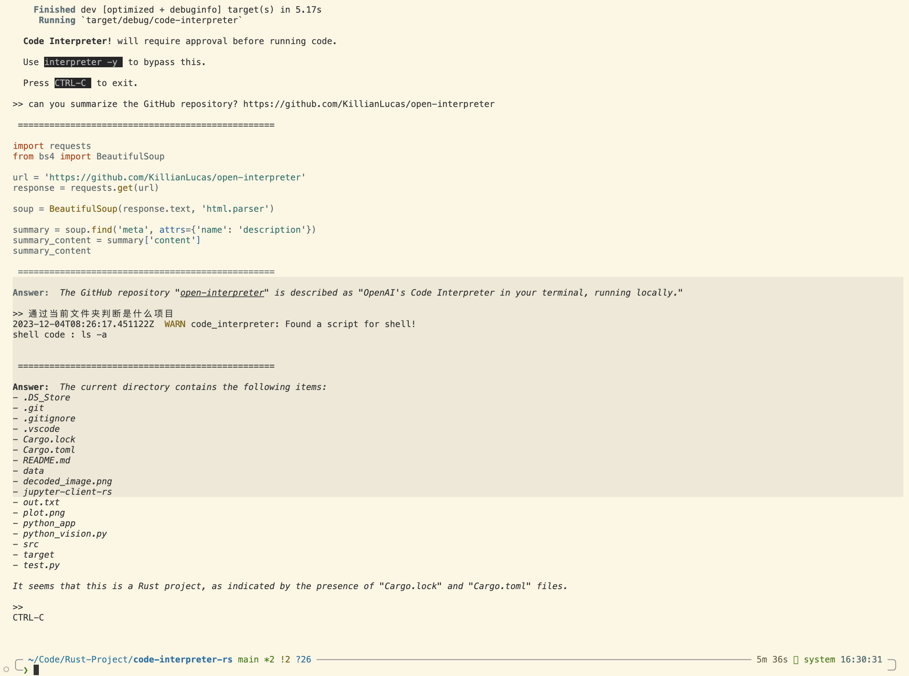

# Code Interpreter

A Rust implementation of an AI-powered code interpreter that executes code in multiple languages (Python, Shell, AppleScript) based on natural language instructions using OpenAI-compatible APIs.

## Features

- 🤖 Natural language to code execution via OpenAI-compatible LLMs
- 🐍 Multiple language support: Python, Shell, AppleScript
- 🔄 Interactive REPL interface with readline support
- 📝 Syntax highlighting for code blocks
- 🌐 RAG-powered procedure recommendations via Open Procedures API
- 📊 Structured logging to `./logs/app.log`
- ⚙️ Flexible configuration via environment variables


## Quick Start

### Demo



### Prerequisites

- Rust 1.70+ (2021 edition)
- Python 3.x (for Python interpreter)
- OpenAI API key or compatible API endpoint

### Installation

```bash
# Clone the repository
git clone <repository-url>
cd Code-Interpreter

# Build the project
cargo build --release

# Run the application
cargo run
```

## Configuration

The application supports the following environment variables:

### Required

- **`OPENAI_API_KEY`** or **`API_KEY`**: Your OpenAI API key or compatible API key

### Optional

- **`OPENAI_BASE_URL`** or **`BASE_URL`**: Custom API base URL (default: OpenAI's API)
  - Example: `https://api.openai.com/v1`
  - Useful for OpenAI-compatible services (e.g., Azure OpenAI, local LLM servers)

- **`OPENAI_MODEL`** or **`MODEL`**: Model name to use
  - Examples: `gpt-4`, `gpt-3.5-turbo`, `claude-3-opus-20240229`

### Example Configuration

```bash
# Basic setup with OpenAI
export OPENAI_API_KEY='sk-...'
cargo run

# Using a custom endpoint and model
export OPENAI_API_KEY='your-api-key'
export OPENAI_BASE_URL='https://api.your-provider.com/v1'
export OPENAI_MODEL='gpt-4'
cargo run

# Or use shorter variable names
export API_KEY='your-api-key'
export BASE_URL='https://api.your-provider.com/v1'
export MODEL='gpt-4'
cargo run
```

## Usage

Once running, the application provides an interactive REPL where you can enter natural language commands:

```
> Calculate the factorial of 10 using Python
> List all files in the current directory
> Create a new folder called 'test' and add a README.md file
```

The AI will generate and execute appropriate code based on your instructions.

## Development

### Build Commands

```bash
# Build for development
cargo build

# Build optimized release version
cargo build --release

# Run tests
cargo test

# Run a specific test
cargo test test_shell_ls

# Check code without building
cargo check
```

